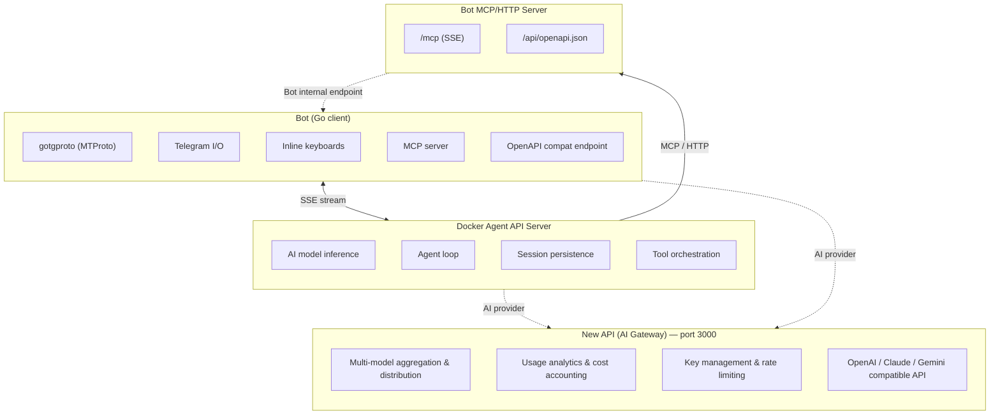

<div align="center">

# tgbot

[](https://go.dev)
[](https://github.com/celestix/gotgproto)
[](https://github.com/modelcontextprotocol/go-sdk)
[](LICENSE)

</div>

A modern Telegram bot built with [gotgproto](https://github.com/celestix/gotgproto) (MTProto) and [Model Context Protocol Go SDK](https://github.com/modelcontextprotocol/go-sdk), powered by [Docker Agent](https://docker.github.io/docker-agent/) for AI inference and tool orchestration. Designed for production deployments with Docker, graceful shutdown, health checks, and rolling updates.

## Features

- **Async-first** — Built on Go with gotgproto for non-blocking Telegram MTProto messaging
- **AI gateway** — [New API](https://github.com/QuantumNous/new-api) for unified multi-model management, key aggregation, and usage analytics
- **AI integration** — OpenAI / Anthropic / AI Gateway providers via Docker Agent
- **AI chat** — Non-command messages are routed to Docker Agent for intelligent, tool-assisted responses
- **MCP protocol** — Exposes Telegram tools via Model Context Protocol (SSE) for AI agent consumption
- **OpenAPI compatible** — Backward-compatible OpenAPI 3.0 endpoint for existing tool consumers
- **Code sandbox** — Isolated code execution via Docker (with security hardening)
- **Health check endpoint** — Exposes `/health` on port 8080 for container orchestration
- **Graceful shutdown** — Handles SIGTERM/SIGINT signals for clean container termination
- **Docker-ready** — Multi-stage Go Dockerfile with Compose deployment

## Architecture



Docker Agent manages AI sessions and tool orchestration. When it needs to call a Telegram API method, it uses MCP protocol (or OpenAPI fallback) to call the Bot's tool server, which executes the actual Telegram API call via MTProto.

[New API](https://github.com/QuantumNous/new-api) serves as the AI gateway layer, aggregating multiple AI providers (OpenAI, Anthropic, Google, DeepSeek, etc.) behind a unified OpenAI-compatible API. Bot and Docker Agent can both connect to it as their AI provider endpoint.

## Getting started

### Prerequisites

- Go 1.26+
- A Telegram bot token from [@BotFather](https://t.me/botfather)
- App ID and API Hash from [my.telegram.org/apps](https://my.telegram.org/apps)
- [Docker Agent](https://docker.github.io/docker-agent/) binary (for local development without Docker)

### Installation

```bash
# Clone the repository
git clone https://github.com/real-LiHua/tgbot.git
cd tgbot

# Download Go dependencies
go mod tidy

# Configure your credentials
cp .env.example .env
# Edit .env and set your APP_ID, API_HASH, BOT_TOKEN
```

### Run the bot

```bash
# Start Docker Agent first
docker-agent serve api agent.yaml &

# Then start the bot
go run ./cmd/bot/
```

## Docker

### Build and run (all services)

```bash
docker compose up --build -d
```

### Individual services

```bash
docker compose up --build -d sandbox    # Sandbox only
docker compose up --build -d new-api    # AI Gateway only
```

## Project structure

```
.
├── cmd/
│   └── bot/
│       └── main.go                # Entry point
├── internal/
│   ├── bot/
│   │   ├── bot.go                 # gotgproto client initialization & lifecycle
│   │   └── handlers.go            # Telegram message handlers
│   ├── ai/
│   │   └── client.go              # Docker Agent SSE client
│   ├── tools/
│   │   ├── telegram.go            # Telegram action implementations
│   │   └── mcp.go                 # MCP server + OpenAPI fallback
│   ├── sandbox/
│   │   └── client.go              # Sandbox HTTP client
│   └── config/
│       └── config.go              # Environment configuration
├── sandbox/
│   ├── Dockerfile                 # Sandbox service Docker image
│   ├── main.py                    # FastAPI code execution sandbox
│   └── requirements.txt
├── agent.yaml                     # Docker Agent configuration
├── docker-agent.Dockerfile        # Docker Agent Docker image
├── dynamic/
│   └── handlers/                  # Hot-loaded handler persistence
├── Dockerfile                     # Multi-stage Go build
├── docker-compose.yml             # Production Compose config (bot + agent + sandbox + new-api)
├── go.mod                         # Go module definition
├── go.sum                         # Go dependency lock file
└── .env.example                   # Environment variable template
```

## Configuration

| Variable | Required | Description |
|---|---|---|
| `APP_ID` | Yes | Telegram App ID from my.telegram.org |
| `API_HASH` | Yes | Telegram API Hash |
| `BOT_TOKEN` | Yes | Telegram bot token from @BotFather |
| `DOCKER_AGENT_URL` | No | Docker Agent URL (default: `http://localhost:8080`) |
| `AI_PROVIDER` | No | AI provider: `openai`, `anthropic`, or `ai_gateway` (default: `openai`) |
| `AI_MODEL_ID` | No | Model ID override (default varies by provider) |
| `BOT_TOOL_API_KEY` | No | API key for tool endpoint authentication |
| `SANDBOX_URL` | No | Sandbox service URL (default: `http://localhost:8080`) |
| `SANDBOX_API_KEY` | No | API key for Sandbox authentication |
| `LISTEN_ADDR` | No | HTTP server listen address (default: `0.0.0.0:8080`) |
| `NEW_API_SESSION_SECRET` | No | New API session secret (required for multi-instance) |
| `NEW_API_CRYPTO_SECRET` | No | New API encryption secret (required with Redis) |
| `NEW_API_SQL_DSN` | No | New API external DB connection string (default: SQLite) |
| `NEW_API_REDIS_CONN_STRING` | No | New API Redis connection string |

## Available commands

| Command | Description |
|---|---|
| `/start` | Welcome message |
| `/ping` | Health check — responds with "pong" |
| `/models` | List available AI models from Docker Agent |
| `/skill` | Agent skill management |

Non-command messages are automatically handled by the **AI chat** system — routed via SSE to Docker Agent for intelligent, tool-assisted conversation.

## Sandbox service

The sandbox service provides isolated code execution in a Docker container:

```
POST /create              Create a new sandbox session
POST /run                 Run a command in a sandbox
POST /read                Read a file from a sandbox
POST /write               Write files to a sandbox
POST /stop/{sandbox_id}   Stop and clean up a sandbox
```

Security features: `cap_drop: ALL`, `no-new-privileges`, read-only filesystem with tmpfs (`/tmp`), resource limits (1 CPU / 256MB / 60s timeout).

## MCP Protocol

The bot exposes Telegram tools via [Model Context Protocol](https://modelcontextprotocol.io) over SSE at `/mcp`:

- `GET /mcp` — SSE stream for MCP client connection
- `POST /mcp` — JSON-RPC methods (`initialize`, `tools/list`, `tools/call`)

Available MCP tools:

| Tool | Description |
|---|---|
| `send_message` | Send a text message to a chat |
| `get_chat_info` | Get chat information |
| `get_chat_member_count` | Get member count |
| `ban_chat_member` | Ban a user |
| `unban_chat_member` | Unban a user |
| `promote_chat_member` | Promote a user to admin |
| `pin_message` | Pin a message |
| `leave_chat` | Leave a chat |
| `set_chat_title` | Change chat title |
| `set_chat_description` | Change chat description |

## Dependencies

- [gotgproto](https://github.com/celestix/gotgproto) — Telegram MTProto client (Go)
- [modelcontextprotocol/go-sdk](https://github.com/modelcontextprotocol/go-sdk) — MCP protocol server implementation
- [gotd/td](https://github.com/gotd/td) — Low-level Telegram MTProto library
- [glebarez/sqlite](https://github.com/glebarez/sqlite) — SQLite session storage
