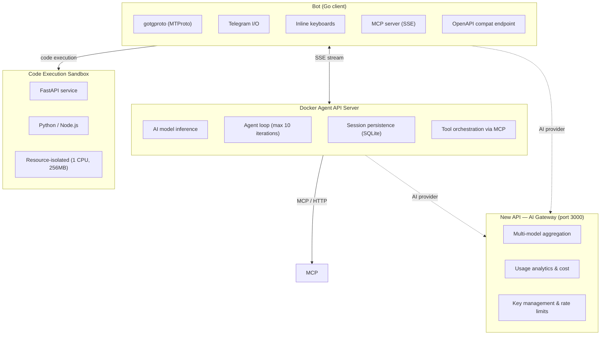

<div align="center">

# tgbot

[](https://go.dev)
[](https://github.com/celestix/gotgproto)
[](LICENSE)

</div>

A Telegram bot powered by AI — built with Go (MTProto), Docker Agent for tool-assisted inference, and a sandboxed code execution environment. Deployable with Podman (rootless, daemonless) in development or production.

---

## 30-second overview

```
Telegram user → Bot (Go/MTProto) → Docker Agent (AI) → OpenAI/Anthropic/Gateway
                                      ↓
                              MCP tools (send_message, ban, pin, etc.)
                                      ↓
                              Bot executes Telegram API calls
```

Non-command messages go to Docker Agent for AI processing. When the AI needs to act (send a message, manage members, etc.), it calls Telegram tools via MCP protocol. The bot also exposes a code sandbox for AI-proposed script execution.

## Features

- **AI chat** — Non-command messages are routed through Docker Agent for intelligent, tool-assisted conversations
- **MCP protocol** — Exposes Telegram actions as MCP tools over SSE for AI agent consumption
- **Multiple AI providers** — OpenAI, Anthropic, or AI Gateway (New API) via Docker Agent
- **AI gateway** — New API for unified multi-model management, key aggregation, and usage analytics
- **Code sandbox** — Isolated FastAPI service for executing AI-proposed code (Python/Node.js) with resource limits
- **Inline keyboards** — Interactive callback-based UI components
- **Graceful shutdown** — SIGTERM/SIGINT handling for clean container lifecycle
- **Podman-ready** — Rootless deployment with podman-compose or Quadlet systemd integration

## Getting started

### Prerequisites

- Go 1.26+
- A Telegram bot token from [@BotFather](https://t.me/botfather)
- App ID and API Hash from [my.telegram.org/apps](https://my.telegram.org/apps)
- [Docker Agent](https://github.com/docker/docker-agent) binary (for local development without containers)

### Setup

```bash
git clone https://github.com/real-LiHua/tgbot.git
cd tgbot

# Install dependencies
go mod tidy

# Configure your credentials
cp .env.example .env
# Edit .env — set APP_ID, API_HASH, BOT_TOKEN, and at least one AI provider key
```

### Run locally

```bash
# Start Docker Agent first
docker-agent serve api agent.yaml &

# Then start the bot
go run ./cmd/bot/
```

## Architecture



### Components

| Component | Role | Tech |
|---|---|---|
| **Bot** | Telegram client + MCP server | Go, gotgproto |
| **Docker Agent** | AI engine, session management, tool orchestration | [Docker Agent](https://github.com/docker/docker-agent) |
| **New API** | AI gateway (unified API for multiple providers) | [calciumion/new-api](https://github.com/QuantumNous/new-api) |
| **Sandbox** | Isolated code execution (AI-proposed scripts) | FastAPI (Python) |

**Communication flow**: Bot creates a Docker Agent session via HTTP and receives SSE events. When the AI needs a Telegram action, Docker Agent calls the Bot's MCP endpoint (`/mcp`). The Bot executes the action via MTProto and returns the result.

## Deployment

### Podman Compose (development)

```bash
podman-compose up -d
```

### Quadlet + systemd (production)

```bash
# Build, deploy, and enable on boot
bash pod/podman-deploy.sh enable

# Or just deploy without autostart
bash pod/podman-deploy.sh quadlet
```

Four containers are deployed on an internal bridge network:

| Container | Description |
|---|---|
| `tgbot-bot` | Go Telegram bot + MCP/HTTP server on `:8080` |
| `tgbot-docker-agent` | AI engine, configured via `agent.yaml` |
| `tgbot-sandbox` | Code execution sandbox (Python 3.14 + Node.js) |
| `tgbot-new-api` | AI gateway on `:3000` |

## Commands

| Command | Description |
|---|---|
| `/start` | Welcome message |
| `/ping` | Health check — responds with "pong" |
| `/models` | List available AI models from Docker Agent |
| `/skill` | Agent skill management |

Non-command text messages are automatically handled by the AI chat system — routed via SSE to Docker Agent for intelligent, tool-assisted conversation.

## MCP protocol

The bot exposes Telegram tools via [Model Context Protocol](https://modelcontextprotocol.io) over SSE at `GET/POST /mcp`:

| Tool | Description |
|---|---|
| `send_message` | Send a text message to a chat |
| `get_chat_info` | Get chat information |
| `get_chat_member_count` | Get member count |
| `ban_chat_member` | Ban a user from a chat |
| `unban_chat_member` | Unban a user from a chat |
| `promote_chat_member` | Promote a user to admin |
| `pin_message` | Pin a message in a chat |
| `leave_chat` | Leave a chat or group |
| `set_chat_title` | Change the title of a chat |
| `set_chat_description` | Change the description of a chat |

These tools are registered in `agent.yaml` as an MCP toolset:

```yaml
toolsets:
  - type: mcp
    url: "http://bot:8080/mcp"
    headers:
      X-Api-Key: "${env.BOT_TOOL_API_KEY}"
```

## Configuration

| Variable | Required | Default | Description |
|---|---|---|---|
| `APP_ID` | Yes | — | Telegram App ID |
| `API_HASH` | Yes | — | Telegram API Hash |
| `BOT_TOKEN` | Yes | — | Telegram bot token |
| `DOCKER_AGENT_URL` | No | `http://localhost:8080` | Docker Agent URL |
| `AI_PROVIDER` | No | `openai` | AI provider (`openai` / `anthropic` / `ai_gateway`) |
| `AI_MODEL_ID` | No | provider default | Model ID override |
| `BOT_TOOL_API_KEY` | No | — | API key for MCP tool authentication |
| `SANDBOX_URL` | No | `http://localhost:8080` | Sandbox service URL |
| `SANDBOX_API_KEY` | No | — | Sandbox authentication key |
| `LISTEN_ADDR` | No | `0.0.0.0:8080` | HTTP server listen address |

> [!NOTE]
> New API gateway variables (`NEW_API_SESSION_SECRET`, `NEW_API_CRYPTO_SECRET`, etc.) are only needed when deploying the AI gateway component. See `.env.example` for the full list.

## Project structure

```
.
├── cmd/bot/main.go            # Entry point
├── internal/
│   ├── bot/
│   │   ├── bot.go             # gotgproto client lifecycle
│   │   └── handlers.go        # Message/command handlers
│   ├── ai/client.go           # Docker Agent SSE client
│   ├── tools/
│   │   ├── telegram.go        # Telegram action implementations
│   │   └── mcp.go             # MCP server + OpenAPI fallback
│   ├── sandbox/client.go      # Sandbox HTTP client
│   └── config/config.go       # Environment configuration
├── sandbox/                   # Code execution sandbox service
│   ├── main.py                # FastAPI application
│   ├── Dockerfile             # Python 3.14 + Node.js image
│   └── requirements.txt
├── agent.yaml                 # Docker Agent configuration
├── docker-agent.Dockerfile    # Docker Agent container
├── Dockerfile                 # Bot multi-stage Go build
├── podman-compose.yml         # Podman Compose deployment
├── pod/                       # Quadlet systemd files
│   ├── tgbot-*.container      # Container definitions
│   ├── tgbot.network          # Network definition
│   └── podman-deploy.sh       # Deployment script
└── dynamic/handlers/          # Hot-loaded handler persistence
```

## Dependencies

- [gotgproto](https://github.com/celestix/gotgproto) — Telegram MTProto client for Go
- [modelcontextprotocol/go-sdk](https://github.com/modelcontextprotocol/go-sdk) — MCP protocol server implementation
- [gotd/td](https://github.com/gotd/td) — Low-level Telegram MTProto library
- [FastAPI](https://fastapi.tiangolo.com/) — Sandbox web framework (Python)
